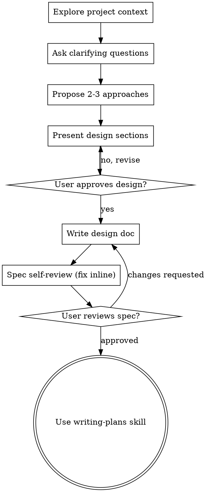

# Brainstorming Ideas Into Designs

Help turn ideas into fully formed designs and specs through natural collaborative dialogue.

Start by understanding the current project context, then ask questions one at a time to refine the idea. Once you understand what you're building, present the design and get user approval.

<HARD-GATE>
Do NOT invoke any implementation skill, write any code, scaffold any project, or take any implementation action until you have presented a design and the user has approved it. This applies to EVERY project regardless of perceived simplicity.
</HARD-GATE>

## Anti-Pattern: "This Is Too Simple To Need A Design"

Every project goes through this process. A todo list, a single-function utility, a config change — all of them. "Simple" projects are where unexamined assumptions cause the most wasted work. The design can be short (a few sentences for truly simple projects), but you MUST present it and get approval.

## Checklist

Create a `todo_write` entry for each of these and complete them in order:

1. **Explore project context** — check files, docs, recent commits
2. **Ask clarifying questions** — one at a time, understand purpose/constraints/success criteria
3. **Propose 2-3 approaches** — with trade-offs and your recommendation
4. **Present design** — in sections scaled to their complexity, get user approval after each section
5. **Write design doc** — save to `docs/reasonix/specs/YYYY-MM-DD-<topic>-design.md` and commit
6. **Spec self-review** — quick inline check for placeholders, contradictions, ambiguity, scope
7. **User reviews written spec** — ask the user to review the spec file before proceeding
8. **Transition to implementation** — use the **writing-plans** skill to create the implementation plan

## Process Flow

**The terminal state is using the writing-plans skill.** Do NOT invoke any other implementation skill after brainstorming. The ONLY skill you invoke next is writing-plans.

## The Process

**Understanding the idea:**

- Check the current project state first (files, docs, recent commits)
- Before asking detailed questions, assess scope: if the request describes multiple independent subsystems (e.g., "build a platform with chat, file storage, billing, and analytics"), flag this immediately. Don't refine details of a project that needs decomposing first.
- If the project is too large for a single spec, help the user decompose into sub-projects: what are the independent pieces, how do they relate, what order should they be built? Then brainstorm the first sub-project through the normal flow. Each sub-project gets its own spec → plan → implementation cycle.
- For appropriately-scoped projects, ask questions one at a time to refine the idea
- Prefer multiple-choice questions when possible — use the `ask` tool to present them. Open-ended is fine too.
- Only one question per message — if a topic needs more exploration, break it into multiple questions
- Focus on understanding: purpose, constraints, success criteria

**Exploring approaches:**

- Propose 2-3 different approaches with trade-offs
- Present options conversationally with your recommendation and reasoning
- Lead with your recommended option and explain why

**Presenting the design:**

- Once you understand what you're building, present the design
- Scale each section to its complexity: a few sentences if straightforward, up to 200-300 words if nuanced
- Ask after each section whether it looks right so far
- Cover: architecture, components, data flow, error handling, testing
- For anything visual or structural, sketch it in text — ASCII layout, a tree, or a small fenced diagram. The terminal is the medium; make options legible there.
- Be ready to go back and clarify if something doesn't make sense

**Design for isolation and clarity:**

- Break the system into smaller units that each have one clear purpose, communicate through well-defined interfaces, and can be understood and tested independently
- For each unit, answer: what does it do, how do you use it, what does it depend on?
- Can someone understand what a unit does without reading its internals? Can you change the internals without breaking consumers? If not, the boundaries need work.
- Smaller, well-bounded units are easier for you to work with — you reason better about code you can hold in context at once. When a file grows large, that's often a signal it's doing too much.

**Working in existing codebases:**

- Explore the current structure before proposing changes. Follow existing patterns.
- Where existing code has problems that affect the work (a file grown too large, unclear boundaries, tangled responsibilities), include targeted improvements as part of the design — the way a good developer improves code they're working in.
- Don't propose unrelated refactoring. Stay focused on what serves the current goal.

## After the Design

**Documentation:**

- Write the validated design (spec) to `docs/reasonix/specs/YYYY-MM-DD-<topic>-design.md` (user preferences override this default)
- Commit the design document to git

**Spec Self-Review** — look at the spec with fresh eyes:

1. **Placeholder scan:** Any "TBD", "TODO", incomplete sections, or vague requirements? Fix them.
2. **Internal consistency:** Do any sections contradict each other? Does the architecture match the feature descriptions?
3. **Scope check:** Is this focused enough for a single implementation plan, or does it need decomposition?
4. **Ambiguity check:** Could any requirement be interpreted two ways? If so, pick one and make it explicit.

Fix issues inline. No need to re-review — just fix and move on.

**User Review Gate** — after the spec review loop passes:

> "Spec written and committed to `<path>`. Please review it and let me know if you want any changes before we start writing the implementation plan."

Wait for the user's response. If they request changes, make them and re-run the spec review loop. Only proceed once the user approves.

**Implementation:**

- Use the **writing-plans** skill to create a detailed implementation plan
- Do NOT invoke any other skill. writing-plans is the next step.

## Key Principles

- **One question at a time** — don't overwhelm
- **Multiple choice preferred** (use the `ask` tool) — easier to answer than open-ended
- **YAGNI ruthlessly** — remove unnecessary features from all designs
- **Explore alternatives** — always propose 2-3 approaches before settling
- **Incremental validation** — present design, get approval before moving on
- **Be flexible** — go back and clarify when something doesn't make sense
