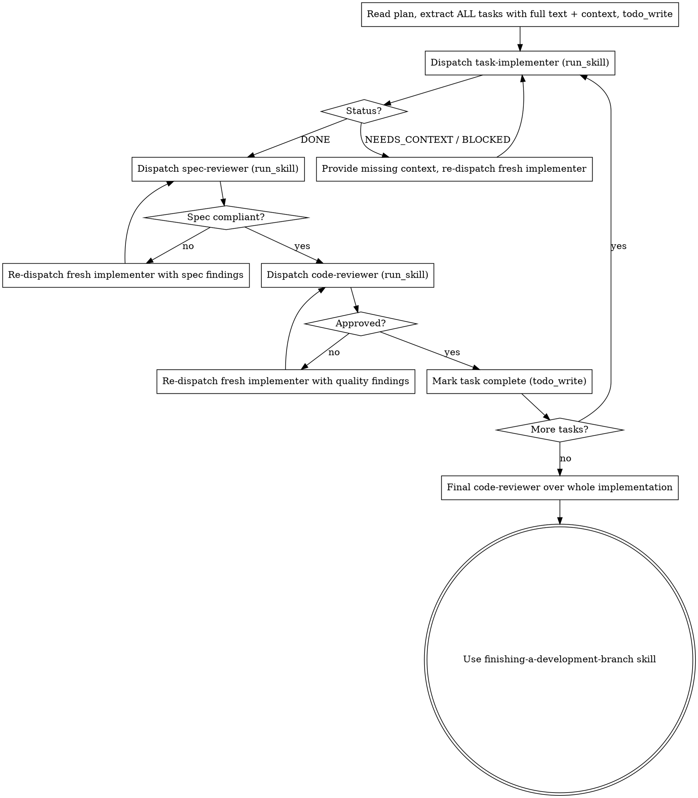

# Subagent-Driven Development

Execute a plan by dispatching a fresh subagent per task, with two-stage review after each: spec compliance first, then code quality.

**Why subagents:** You delegate tasks to focused subagents with isolated context. By crafting their input precisely, you keep them on task and preserve your own context for coordination. They never inherit your session history — you construct exactly what they need.

**Core principle:** Fresh subagent per task + two-stage review (spec then quality) = high quality, fast iteration.

**Continuous execution:** Do not pause to check in between tasks. Execute all tasks without stopping. The only reasons to stop are: a `BLOCKED` status you cannot resolve, ambiguity that genuinely prevents progress, or all tasks complete. "Should I continue?" prompts waste the user's time — they asked you to execute the plan, so execute it.

## The Reasonix Subagent Model

You dispatch each role with **`run_skill`**, passing everything the child needs in `arguments` (its only input — the child's system prompt is the skill body):

| Role | Dispatch | `arguments` carries |
|------|----------|---------------------|
| Implementer | `run_skill {name: "task-implementer", arguments: ...}` | full task text + scene-setting context + working directory |
| Spec reviewer | `run_skill {name: "spec-reviewer", arguments: ...}` | the requirements + implementer's report + git range / file list |
| Code reviewer | `run_skill {name: "code-reviewer", arguments: ...}` | description of work + requirements + `BASE_SHA..HEAD_SHA` |

Two hard constraints of Reasonix subagents shape this workflow:

1. **No recursion.** Subagents cannot call `run_skill`/`task` — they can't load other skills. That's why `task-implementer` has TDD folded into its own body; you don't tell it to "use the TDD skill."
2. **No mid-run back-and-forth, stateless dispatch.** A subagent returns only its final message. To have the implementer fix review findings, dispatch a **fresh `task-implementer`** whose `arguments` include the original task PLUS the reviewer's findings PLUS "fix exactly these." Carry context forward yourself — don't rely on the child remembering anything.

(If you prefer, the generic `task` tool also works for ad-hoc roles, but the named subagent skills above are the supported path.)

## The Process



## Model Selection

Use the least powerful model that can handle each role, to conserve cost and increase speed. Set per-role models in `reasonix.toml`:

```toml
[agent]
subagent_models = { task-implementer = "deepseek-chat", spec-reviewer = "deepseek-chat", code-reviewer = "deepseek-reasoner" }
```

- **Mechanical implementation** (1-2 files, complete spec) → fast/cheap model
- **Integration & judgment** (multi-file, debugging) → standard model
- **Architecture, design, review** → most capable model (DeepSeek-Reasoner / a reasoning model)

A per-skill `model:`/`effort:` in the worker skill's frontmatter also works; `subagent_models` overrides it.

## Handling Implementer Status

**DONE** → proceed to spec compliance review.

**DONE_WITH_CONCERNS** → read the concerns first. If about correctness or scope, address them before review. If observations ("this file is getting large"), note and proceed.

**NEEDS_CONTEXT** → the implementer lacked information. Add the missing context to `arguments` and dispatch a fresh implementer.

**BLOCKED** → assess the blocker: (1) context problem → add context, re-dispatch same model; (2) needs more reasoning → re-dispatch with a more capable model; (3) task too large → break it into smaller pieces; (4) the plan itself is wrong → escalate to the human. **Never** force the same model to retry unchanged.

## Example

```
[read_file the plan once; extract all 5 tasks with full text + context; todo_write all 5]

Task 1: Hook installation script
  run_skill task-implementer  (arguments: Task 1 full text + context + dir)
  → DONE: implemented, 5/5 tests passing, committed
  run_skill spec-reviewer     (arguments: Task 1 requirements + report + range)
  → ✅ Spec compliant
  run_skill code-reviewer     (arguments: description + requirements + BASE..HEAD)
  → Approved. Mark Task 1 complete.

Task 2: Recovery modes
  run_skill task-implementer  → DONE
  run_skill spec-reviewer     → ❌ Missing progress reporting; extra --json flag
  run_skill task-implementer  (arguments: original task + "remove --json, add progress reporting")
  run_skill spec-reviewer     → ✅ Spec compliant now
  run_skill code-reviewer     → Issue: magic number 100
  run_skill task-implementer  (arguments: "extract PROGRESS_INTERVAL constant")
  run_skill code-reviewer     → ✅ Approved. Mark Task 2 complete.

[... all tasks ...]
run_skill code-reviewer (whole implementation) → ready
→ Use finishing-a-development-branch skill
```

## Red Flags

**Never:**
- Start implementation on main/master without explicit user consent
- Skip either review (spec compliance OR code quality)
- Start code quality review before spec compliance is ✅ (wrong order)
- Proceed to the next task with unfixed issues in either review
- Dispatch multiple implementer subagents in parallel for the same files (conflicts)
- Make a subagent read the plan file — paste the full task text into `arguments`
- Skip scene-setting context — the subagent needs to understand where the task fits
- Accept "close enough" on spec compliance

**If a reviewer finds issues:** dispatch a fresh implementer with the findings in `arguments`, re-review, repeat until approved. Don't skip the re-review.

## Integration

**Required workflow skills:** **using-git-worktrees** (isolated workspace) · **writing-plans** (creates the plan) · **finishing-a-development-branch** (after all tasks). **Alternative:** **executing-plans** for inline same-session execution without per-task subagents.
