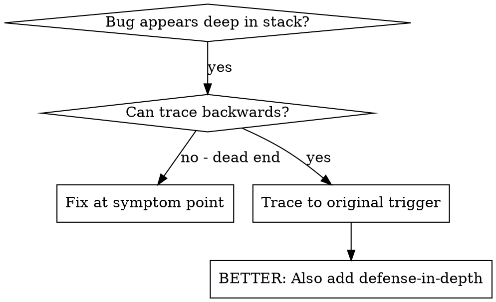
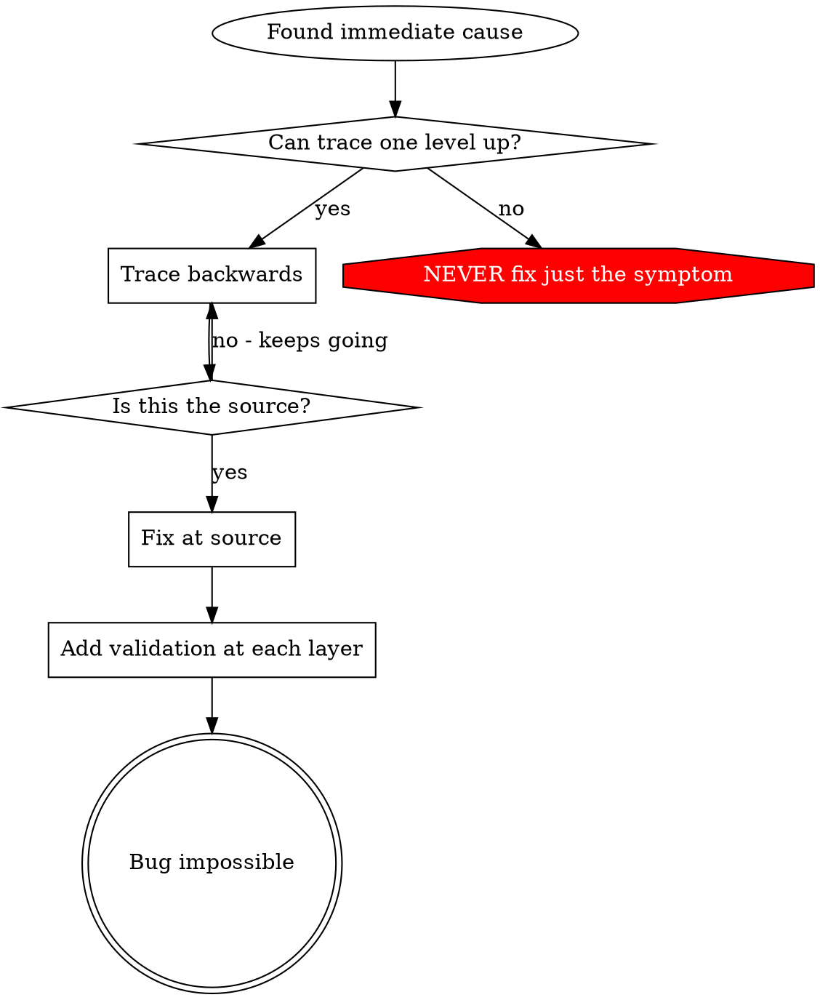

# Root Cause Tracing

## Overview

Bugs often manifest deep in the call stack (git init in wrong directory, file created in wrong location, database opened with wrong path). Your instinct is to fix where the error appears, but that's treating a symptom.

**Core principle:** Trace backward through the call chain until you find the original trigger, then fix at the source.

## When to Use



**Use when:** error happens deep in execution (not at entry point); stack trace shows a long call chain; unclear where invalid data originated; need to find which test/code triggers the problem.

## The Tracing Process

1. **Observe the Symptom** — `Error: git init failed in ~/project/packages/core`
2. **Find Immediate Cause** — what code directly causes this? `await execFileAsync('git', ['init'], { cwd: projectDir })`
3. **Ask: What Called This?** — `createSessionWorktree(projectDir)` ← `initializeWorkspace()` ← `Session.create()` ← test
4. **Keep Tracing Up** — what value was passed? `projectDir = ''` (empty string → resolves to `process.cwd()` → the source dir!)
5. **Find Original Trigger** — where did the empty string come from? `const ctx = setupCoreTest(); // { tempDir: '' }` accessed before `beforeEach`

## Adding Stack Traces

When you can't trace manually, add instrumentation:

```typescript
async function gitInit(directory: string) {
  console.error('DEBUG git init:', {
    directory, cwd: process.cwd(), stack: new Error().stack,
  });
  await execFileAsync('git', ['init'], { cwd: directory });
}
```

**Critical:** Use `console.error()` in tests (loggers may be suppressed). Log **before** the dangerous operation, not after it fails. Include directory, cwd, env vars, timestamps. Capture `new Error().stack` for the full call chain.

**Run and capture:** `npm test 2>&1 | grep 'DEBUG git init'`. Look for test file names and line numbers; identify the pattern (same test? same parameter?).

## Finding Which Test Causes Pollution

If something appears during tests but you don't know which test, bisect with the bundled `scripts/find-polluter.sh`:

```bash
./scripts/find-polluter.sh '.git' 'src/**/*.test.ts'
```

Runs tests one-by-one, stops at the first polluter.

## Key Principle



**NEVER fix just where the error appears.** Trace back to the original trigger, fix at the source, then add defense-in-depth validation at each layer the bad value passed through.
